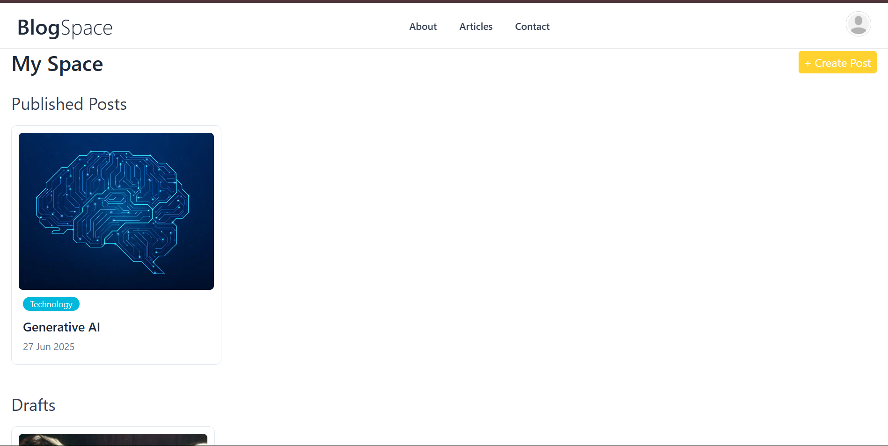
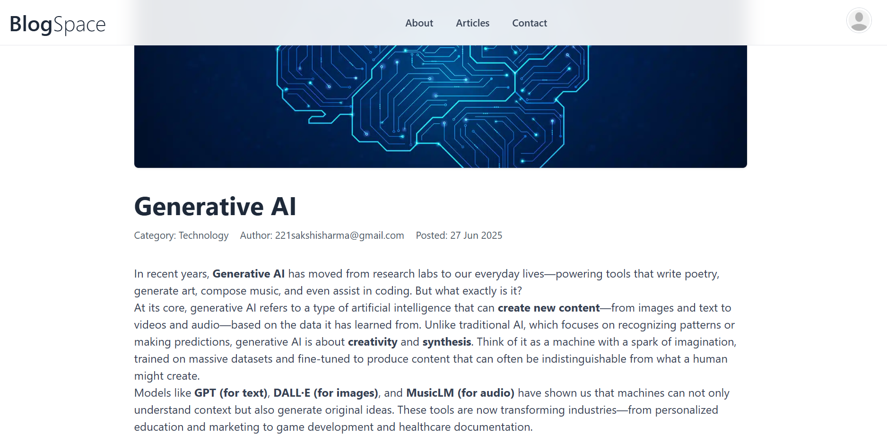
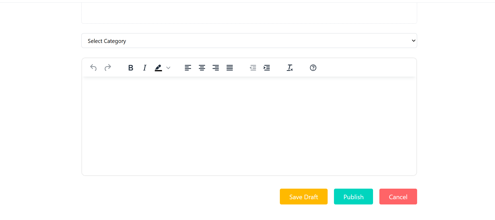

# 📝 React Blog App

A full-featured blog application built with **React**, **Redux**, **Appwrite**, and **TinyMCE** that allows users to create, edit, and manage blog posts. The app supports user authentication, rich text editing, and post categorization.

## 🚀 Features

- 🔐 **Authentication** with Appwrite  
- 🖊️ **Create / Read / Update / Delete (CRUD)** functionality  
- 📰 **Rich text editor** using TinyMCE  
- ⚙️ **State management** with Redux Toolkit  
- 📄 **Dynamic HTML rendering** using `html-react-parser`  
- 📥 **Form handling** with `react-hook-form`  
- 🏷️ **Categorization and filtering** of posts  
- 📦 **Appwrite database and storage** integration  

## 🧑‍💻 Tech Stack

- **Frontend**: React, Redux Toolkit, Tailwind CSS  
- **Backend-as-a-Service**: Appwrite  
- **Editor**: TinyMCE  
- **Form Handling**: React Hook Form  
- **HTML Parsing**: html-react-parser  
- **Routing**: React Router DOM  

## 📸 Preview

| Home Page | Create Post |
|-----------|-------------|
|  |  |

| View Post | Dashboard |
|-----------|-----------|
|  |  |
